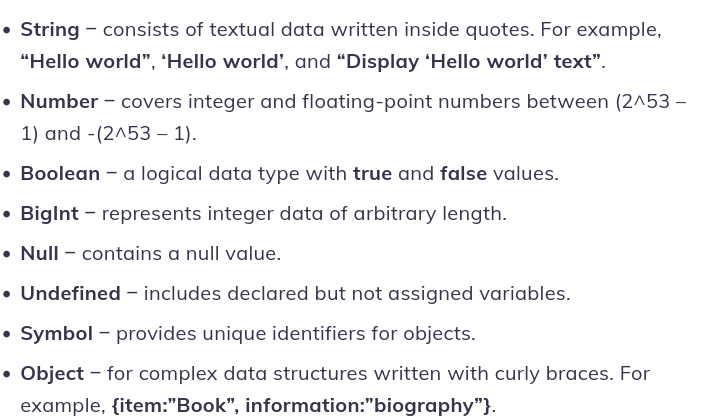
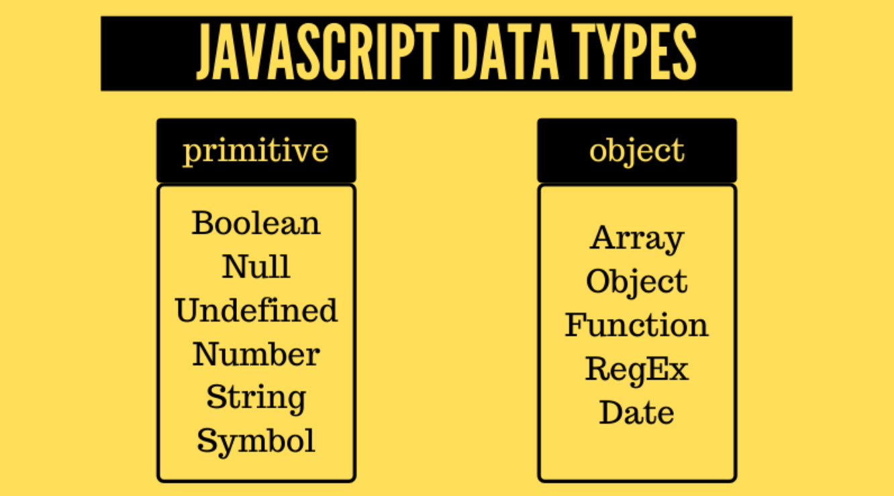

# WHAT IS ?


#### JavaScript was invented by Brendan Eich in 1995. It was developed for Netscape 2, and became the ECMA-262 standard in 1997.


#### JS
>[!TIP]
>JavaScript is a scripting or programming language that allows you to implement complex features on web pages---every time a web page does more than just sit there and display static information for you to look at `i mean it will not update that page` And also whant to explain that JavaSript can't work without HTML and CSS 

* `HTML` is the markup language that we use to structure and give meaning to our web content, for example defining paragraphs, headings, and data tables, or embedding images and videos in the page.
* `CSS` is a language of style rules that we use to apply styling to our HTML content, for example setting background colors and fonts, and laying out our content in multiple columns.
* `JavaScript` is a scripting language that enables you to create dynamically updating content, control multimedia, animate images, and pretty much everything else. (Okay, not everything, but it is amazing what you can achieve with a few lines of JavaScript code.)

if you whant to gain more information about this programming language you can follow to this <a href="https://developer.mozilla.org/en-US/docs/Learn/JavaScript/First_steps/What_is_JavaScript">Web</a> <a href="https://developer.mozilla.org/en-US/docs/Learn/JavaScript/First_steps/What_is_JavaScript">Page</a>

>JavaSript Является реализацией спецификации ECMAScript (стандарт ECMA-262[2]).      

>[!TIP]
> in JavaSript we have got 3 kind of keywords
`var` `let` and `const`


>[!TIP]

in JS we have got 7 primitives and more over objects
```js
undefined
null
number
string
booleon
symbol
bigInt
```

it was primitives in JS 
>

>Operators in JavaScript
``` js
+ 	Addition
- 	Subtraction
* 	Multiplication
** 	Exponentiation (ES2016)
/ 	Division
% 	Modulus (Division Remainder)
++ 	Increment
-- 	Decrement
```
```js
Operator    Examples        Same As
=          	x = y 	        x = y
+= 	        x += y 	        x = x + y
-= 	        x -= y 	        x = x - y
*= 	        x *= y 	        x = x * y
/= 	        x /= y 	        x = x / y
%= 	        x %= y 	        x = x % y
**= 	    x **= y 	    x = x ** y
```

>JavaScript Comparison Operators
Operator 	Description
``` js
== 	equal to
=== 	equal value and equal type
!= 	not equal
!== 	not equal value or not equal type
> 	greater than
< 	less than
>= 	greater than or equal to
<= 	less than or equal to
? 	ternary operator
```

>JavaScript Logical Operators
Operator 	Description

``` js
&& 	logical and
|| 	logical or
! 	logical not
```

>
JavaScript Type Operators
Operator 	Description
``` js
typeof 	Returns the type of a variable
instanceof 	Returns true if an object is an instance of an object type
```


>[!TIP]
>The `if/else` statement executes a block of code if a specified condition is true. If the condition is false, another block of code can be executed. The if/else statement is a part of JavaScript's `"Conditional"` Statements, which are used to perform different actions based on different conditions.


```js
function condition(a) {
    if(a<=14){
        return "Sorry but you are not to old"
    }
    else{
        return "Yes you are exist"
    }
}
console.log(condition(6));//Sorry but you are not to old
```

>[!TIP]
>The conditional (ternary) operator is the only JavaScript operator that takes three operands: a condition followed by a question mark ( ? ), then an expression to execute if the condition is truthy followed by a colon ( : ), and finally the expression to execute if the condition is falsy.

``` js
function condition(a) {
    return a<=14 ? "Sorry but you are not to old" : "Yes you are exist"
}
console.log(condition(6));//Sorry but you are not to old
```

>[!TIP]
>The switch statement `executes a block of code depending on different cases`. The switch statement is a part of JavaScript's "Conditional" Statements, which are used to perform different actions based on different conditions. Use switch to select one of many blocks of code to be executed.

``` js
let expr = 'Papayas';
switch (expr) {
  case 'Oranges':
    console.log('Oranges are $0.59 a pound.');
    break;
  case 'Mangoes':
  case 'Papayas':
    console.log('Mangoes and papayas are $2.79 a pound.');
    // Expected output: "Mangoes and papayas are $2.79 a pound."
    break;
  default:
    console.log(`Sorry, we are out of ${expr}.`);
}
```

>[!TIP]
>for - loops through a block of code a number of times. for/in - loops through the properties of an object. for/of - loops through the values of an iterable object. while - loops through a block of code while a specified condition is true.
and hep here i said something about `for/in` it we will learn about it in object


```js
function condition(a) {
    let cnt=0
    for(let i=0; i<=a; i++){
         cnt+=i
    }
    return cnt
}
console.log(condition(6));//21
```

>while and do-while in doing the same thing in like a for in JS `they create loop`

>[!TIP]
>Function Declaration in JS
``` js
function declaration(a,b) {
    return a+b
}
console.log(declaration(2,3));//5
```

>[!TIP]
>Function Expression (Arrow)
``` js
let a=(a)=>{
    return a+1
}
console.log(a(4));//5
```

>[!TIP]
>Function Expression (Anonymous)
``` js
let anon = function() {
  alert('I am anonymous');
}
anon(); //This is anonymous function
```
>[!TIP]
>IIFE (Immediatly invoked function expression)
``` js
(function() {
let numb = 4 + 4;
console.log(numb);
})();//8
```